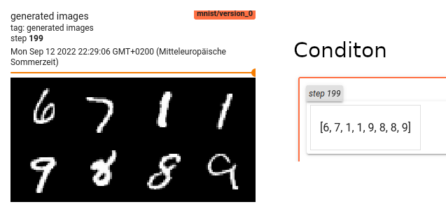
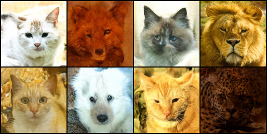
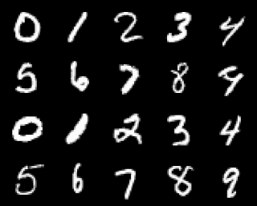
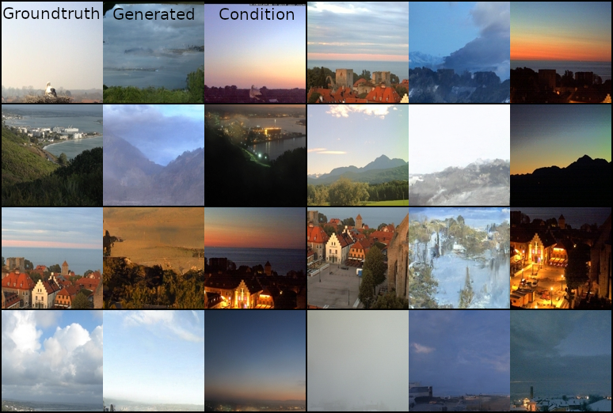
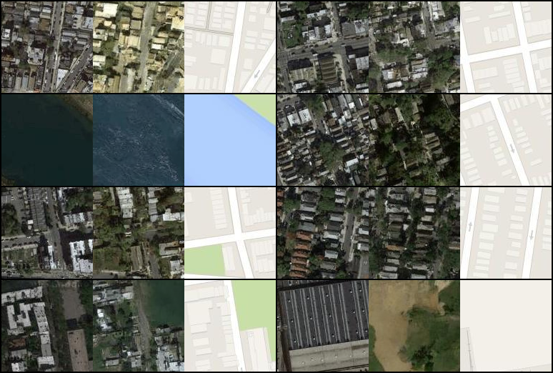

# Readable Conditional Denoising Diffusion
## This is the official implementation of the Paper --To be submitted/Under Review--. A frozen branch for reproduction is under TODO ---[here](TODO) TODO---.  

## Install Python environment

This is a more readable implementation of Diffusion based one [lucidrains/denoising-diffusion-pytorch](https://github.com/lucidrains/denoising-diffusion-pytorch). This implementation supports additional papers (see code), DDIM sampling, and Label and Image conditions. 


We intend to update this repository to make it more readable. For Black and White images the diffusion process can be done on a single GPU. For color images, we tried to stabilize the diffusion process without requiring huge batch sizes. Currently, most diffusion mechanisms have stability issues with small batch sizes, the avg color is shifting during training. You can fix this by using DDIM instead of DDPM, if the images never converse. Please update us if you have functioning config files or examples where the Diffusion always has meandering colors.

We want to increase readability. If you find typos or unclear code please make an issue or a pull request. 

This repository also contains a [CUT](https://arxiv.org/abs/2007.15651) (unpaired), CUT (paired), and [Pix2Pix](https://phillipi.github.io/pix2pix/) implementation. The start file is CUT.py.

There are experimental files: diffusion_latened.py, diffusion_network_based_guidance.py, CUT_diffusion.py, and AutoencoderKL.py, The support for these files is limited.

We are open for feed back!


```properties
conda env create -f environment_small.yml
```


## Label2Image
You can use a classification dataset and condition on the classes.

### Adding a dataset



You can use the same data structure like AFHQ. The folder will be automatically added. The sub-folders are the classes and the ids are sorted in alphabetical order. Or you can use and data set the spits out an image and an id and added in the "loader/load_dataset.py" like it was done with MNIST. In this case add the name to the dataset_names_label2img in the file.
```python
dataset_names_label2img = ["MNIST", "MY-NEW-LABELED-DATASET"]
...
if dataset == "MNIST":
    transforms_ = get_transforms(size, set_size, validation=train)
    ds = MNIST(root=root, transform=transforms_, download=True, train=train)
    #with labels
    if learning_type is None or learning_type == "label":
        #num_classes is your DS class count
        #Return also the number of channels. 1 for Black and white images 3 for color images.
        return (Wrapper_Label2Image(ds, num_classes=10, **general_wrapper_info), 1)
    #without label conditioning
    elif learning_type is None or learning_type == "unconditional":
        return (Wrapper_Unconditional(ds, **general_wrapper_info), 1)
    else:
        assert False, learning_type + "is not supported"
```
### Running the diffusion training
```properties 
python3 diffusion.py --config config/Diffusion/MNIST.conf --new --gpu 0
#Get it from https://www.kaggle.com/datasets/andrewmvd/animal-faces and put it in datasets
python3 diffusion.py --config config/Diffusion/AFHQ.conf --new --gpu 0 --size 128 --transform resize
#See for more options:
python diffusion.py --help
```



### Running inference
```python 
import torch, torchvision
from loader.arguments import get_latest_Checkpoint
from diffusion import Diffusion
from loader import load_dataset
from torch.utils.data import DataLoader
import matplotlib.pyplot as plt

name = "mnist"  # exp_name
version = "*"  # * is the newest or use the number for an specific version
batch_size = 10
checkpoint = get_latest_Checkpoint(name, log_dir_name="logs_diffusion", best=False, version="*")
assert checkpoint is not None, "did not found checkpoint"
model = Diffusion.load_from_checkpoint(checkpoint, strict=False)
model.cuda()

label = torch.tensor([0, 1, 2, 3, 4, 5, 6, 7, 8, 9]).cuda()

# DDPM
image_ddpm = model.forward(batch_size, 1000, label=label)
# DDIM
image_ddim, inter = model.forward_ddim(batch_size, [i for i in range(0, 1000, 20)], label=label, eta=0.0)  # type: ignore
assert isinstance(image_ddpm, torch.Tensor)
grid = torchvision.utils.make_grid(torch.cat([image_ddpm, image_ddim], dim=0), nrow=5).cpu()
a = grid.permute(1, 2, 0)
plt.figure(figsize=(40, 40))
plt.imshow(torch.clamp(a, 0, 1))
plt.show()

```


## Image2Image (pix2pix style)
This variant uses the pix2pix data, where a jpg/png has both images and are split by the data loader.
### Adding a dataset
You can download the datasets with the script in datasets/download_paired.sh
```properties
sh download_paired.sh edges2handbags
```
For your one data set add the folder name to dataset_names_img2img-list in "loader/load_dataset.py"

### Running the diffusion training
```properties 
python3 diffusion.py --config config/Diffusion/Image2Image.conf --new -en edges2handbags -ds edges2handbags --transform resize --flip
python3 diffusion.py --config config/Diffusion/Image2Image.conf --new -en handbags2edges -ds edges2handbags --transform resize 
#See for more options:
python diffusion.py --help
```
### Running inference
```python 
import torch, torchvision
from loader.arguments import get_latest_Checkpoint
from diffusion import Diffusion
from loader import load_dataset
from torch.utils.data import DataLoader
import matplotlib.pyplot as plt

name = "edges2handbags"  # exp_name
version = "*"  # * is the newest or use the number for an specific version
batch_size = 10
checkpoint = get_latest_Checkpoint(name, log_dir_name="logs_diffusion", best=False, version="*")
assert checkpoint is not None, "did not found checkpoint"
model = Diffusion.load_from_checkpoint(checkpoint, strict=False)
model.cuda()
opt = model.opt
opt.image_dropout = False
dataset, in_channel = load_dataset.getDataset(opt, train=False,)
train_loader = DataLoader(dataset, batch_size=batch_size,shuffle=True,drop_last=True)

for batch in train_loader:
    img_cond = batch['condition'].cuda()
    # DDPM
    image_ddpm = model.forward(batch_size, 1000, x_conditional=img_cond, w=1)
    # DDIM
    image_ddim, inter = model.forward_ddim(batch_size, list(range(0, 1000, 20)), x_conditional=img_cond, eta=0.0,w=1)      
    break
grid = torchvision.utils.make_grid(torch.cat([image_ddpm, image_ddim], dim=0), nrow=5).cpu()
a = grid.permute(1, 2, 0)
plt.figure(figsize=(40, 40))
plt.imshow(torch.clamp(a, 0, 1))
plt.show()
```





## Image2Image (folder structure)
This file structure will be automatically added as a available data set. Paired file must have the same name.
```
── dataset_name			
│   ├── A
│   │   ├── train
│   │   │   └── *.jpg/.*png
│   │   └── val
│   │       └── *.jpg/.*png
│   └── B
│       ├── train
│       │   └── *.jpg/.*png
│       └── val
│           └── *.jpg/.*png
```
Set learning_type : image

## Image2Image (Medical/any ranges)

Save your slice as an npz with keys that are in the condition_types.

Set the condition_types flag. First is the target, the rest is the image condition
like:
```
-- condition_types [CT, T1]
```
is a mapping from T1 to CT.

In utils/datagen/dataset_generation*.py are examples for slice generation from nii.gz files.


## Embedding2Image

There is rudimentary embedding support. Dependent on the shape, you need to change some things in "models/diffusion_unet". It is maybe better to use Plus instead of concatenation. You have the create a dataset your self. Either use the Wrapper_Embedding2Image or return a dictionary like Wrapper_Embedding2Image

## Tensorboard

We use Tensorboard. Activate it with:
```
tensorboard --logdir logs_diffusion --port 6007
```
cd to the git path. The **logs_diffusion** will be created when you run the diffusion.
You can see training and images got to "http://localhost:6007" in your web browser. The loss of diffusion converges only in the beginning of the training, the model will still improve.

## Acknowledgements

TODO: Grand info