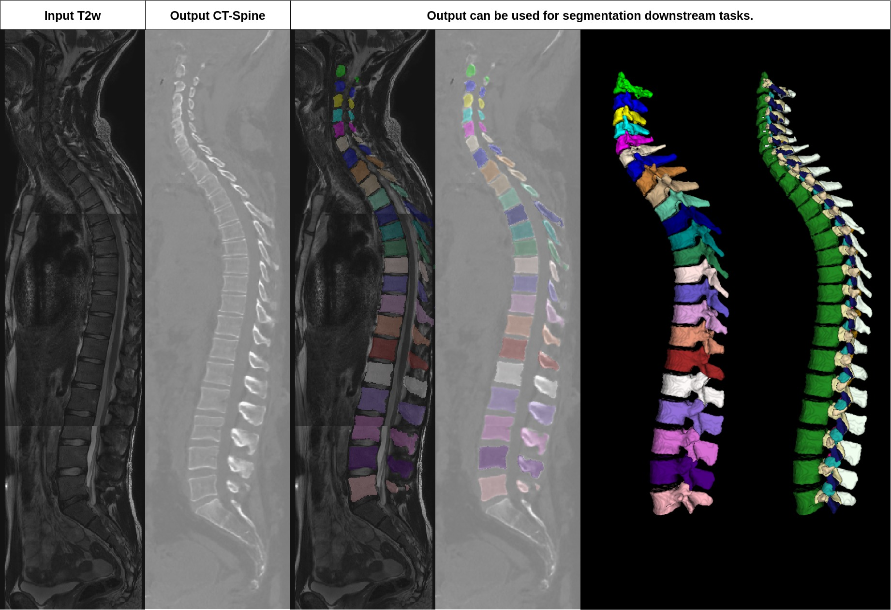

[](https://zenodo.org/badge/latestdoi/605981537)
# Denoising diffusion 3D
This is the official 3D code for "Denoising diffusion-based MR to CT image translation enables whole spine vertebral segmentation in 2D and 3D without manual annotations."


*This repository does not contain a segmentation algorithm.

## Installation


python 3.10 or higher (we recommend to create a new python environment)


install pytorch that fits your GPU
https://pytorch.org/get-started/locally/

Other packages:

```properties
pip install pytorch-lightning numpy configargparse einops ipykernel ipython joblib nibabel pandas scikit-image scikit-learn scipy tqdm ema-pytorch
```

or

```properties
conda env create -f environment_small.yml 
conda activate diffusion3D
```
You may have to reinstall pytorch, if you install it with environment_small.yml; If a google.protobuf fails 
```properties
conda uninstall protobuf
conda install protobuf==3.19
```
## Dataset generation / Training / Inference

See tutorial_image2image_3D.ipynb

## Inference T2w to CT on Sagittal Spine

We provide our weight for DDIM image under 'logs_diffusion3D/Diffusion_3D_T2w_CT_spine_sag/version_0/T2_to_CT_iso_diffusion_img.pt' in the archived version https://zenodo.org/record/8221159 or under this mirror: [Drive-link](https://studentpartnersde-my.sharepoint.com/:f:/g/personal/robert_graf_studentpartners_de/El5c-wZ7TXZJjpo8snSNAAsBpyiAlM4vzaBO5dr3y79fAw?e=O3Xaq3)


We provide sample data in 'data/spine'

See tutorial_T2w_sag_spine_MR2CT.ipynb

## Citation

This code belongs to the paper "Denoising diffusion-based MR to CT image translation enables whole spine vertebral segmentation in 2D and 3D without manual annotations."    
Robert Graf, Joachim Schmitt, Sarah Schlaeger, Hendrik Kristian Möller,Vasiliki Sideri-Lampretsa, Anjany Sekuboyina, Sandro Manuel Krieg, Benedikt Wiestler, Bjoern Menze, Daniel Rueckert, Jan Stefan Kirschke

## Funding 

The research for this article received funding from the European Research Council (ERC) under the European Union’s Horizon 2020 research and innovation program (101045128—iBack-epic—ERC2021-COG). 